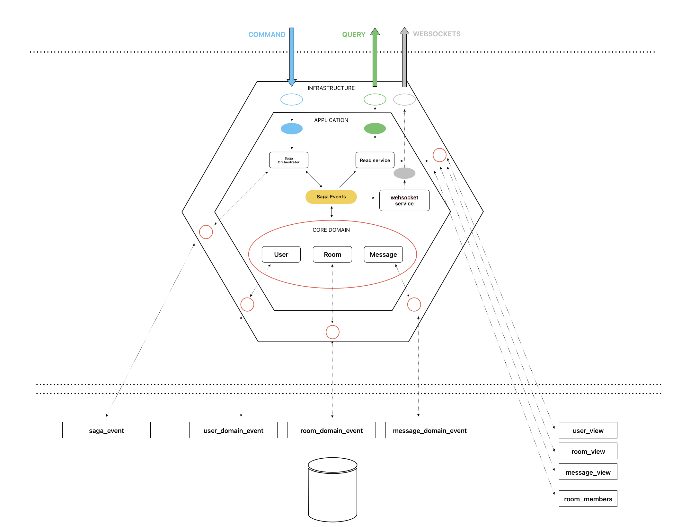
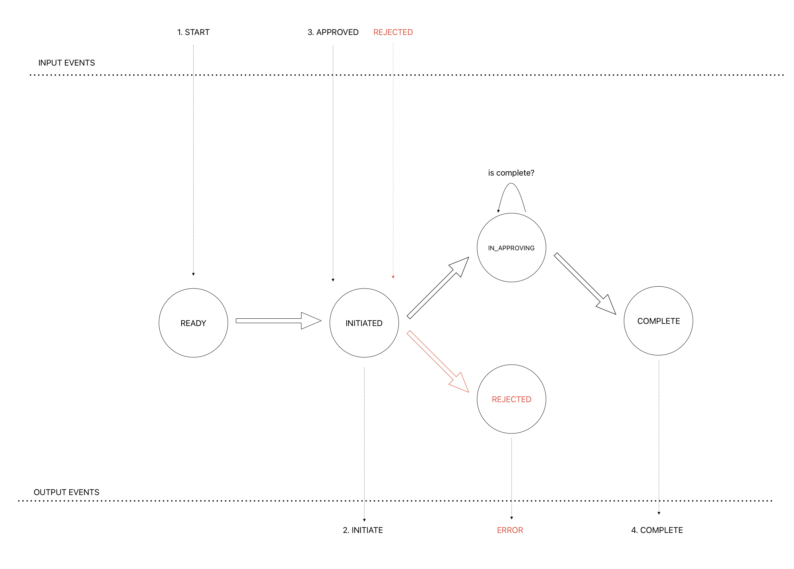

## Table of contents

1. [Introduction](#introduction)  
   1.1 [Project Overview](#11-project-overview)  
   1.2 [Key Features](#12-key-features)  
   1.3 [Technologies Used](#13-technologies-used)

2. [Architecture](#2-architecture)  
   2.1 [System Architecture](#21-system-architecture)  
   2.2 [Saga Orchestration](#22-saga-orchestration)  
   2.3 [Domain-Driven Design Overview](#23-domain-driven-design-overview)  
   2.4 [Event Sourcing Details](#24-event-sourcing-details)  
   2.5 [Reactive Programming Approach](#25-reactive-programming-approach)

3. [Testing](#3-testing)

4. Incomplete Features  
   4.1 Current Limitations  
   4.1 Planned Features

5. Contributing  
   5.1 How to Contribute  
   5.2 Code of Conduct  
   5.3 Contributors

6. License

7. Contact Information

## 1. Introduction

### 1.1 Project Overview

Our application is an advanced chat platform designed to enable seamless communication among users who speak different languages. This platform supports real-time messaging and integrates human translators directly into the chat, allowing for accurate, context-aware translations that maintain the nuance of each conversation. It is ideal for environments requiring precise cross-language
communication, such as multinational organizations, global customer service teams, and diverse project collaborations.

The system allows for two types of user registrations: Regular users can sign up and choose their preferred language, while Translator users select a list of languages they can translate. Users can create rooms, add other users, and designate translators who can translate messages within these rooms.

### 1.2 Key Features

- **Real-time Messaging**: Users can send and receive messages instantly in designated chat rooms.
- **Human-Powered Translations**: Dedicated human translators provide accurate translations, ensuring clarity and context are preserved.
- **Dynamic User Roles**: Two distinct user roles with specific capabilities:
- **Regular Users**: Can participate in rooms and receive translations.
- **Translator Users**: Can provide translations for messages in their proficient languages.
- **Multi-language Support**: Each message can be translated into multiple languages, allowing participants to interact in their native language without barriers.
- **Unique Translator Functionality**: Translators can only add translations for languages they are proficient in and cannot add a translation to a message if it already exists. This ensures that translations are provided by qualified individuals and that messages do not have redundant translations.

### 1.3 Technologies Used

- **Domain-Driven Design**: Structures around the business domain, making it easier to understand and align with business requirements.
- **Saga Orchestration**: Ensures that all steps in a business transaction are completed successfully or compensated if any step fails.
- **Event Sourcing and CQRS**: Implements event sourcing to reliably manage state changes and utilizes CQRS for enhanced performance in read operations
- **Reactive Programming**: Employs Project Reactor to facilitate asynchronous and non-blocking operations.
- **WebSocket Communication**: Enables real-time communication between the web interface and the server.
- **Micronaut Framework**: Utilized for building scalable, efficient microservice architectures.
- **Kotlin**: The primary language for building the application, offering conciseness and safety.
- **Jackson**: For JSON serialization and deserialization.
- **PostgreSQL/MySQL**: As the database system, depending on the deployment.

The `saga-orchestrator-ddd-chat` is an advanced chat application that leverages Domain-Driven Design (DDD) principles and Saga orchestration to provide a robust solution for real-time messaging. This project is designed to showcase how complex business transactions (sagas) that span multiple microservices can be coordinated in a reactive and event-driven architecture. It's ideal for developers
looking to understand the implementation of sagas in microservices architecture or those developing complex systems requiring reliable communication mechanisms.

## 2. Architecture

The architecture of this project is designed to accommodate complex business processes within the domain of messaging and chat operations, using a flexible and scalable approach that leverages Domain-Driven Design (DDD), event sourcing, and reactive programming principles. While structured as a monolithic application for ease of development and deployment, it maintains a clear separation of
concerns through its modular design, enabling potential evolution into a microservices architecture.
Each core component of the system — including `saga_orchestrator`, `user`, `room`, and `message` — encapsulates its own business logic and state management, coordinated through a centralized saga orchestration mechanism that ensures transactional consistency across various operations. This design allows the system to handle complex workflows such as user registration, room management, and message
handling
in a cohesive and robust manner.
The adoption of event sourcing as a fundamental architectural pattern not only enables the system to preserve a complete history of all changes but also provides the flexibility to respond to future requirements and scaling needs. Coupled with a reactive programming approach, the system is well-equipped to handle a high volume of messages with efficiency and resilience, providing real-time
feedback and interactions to the users.
In the following sections, we'll dive deeper into the individual architectural components and their roles within the larger system.

### 2.1 System Architecture

The system architecture is conceived as a unified platform that supports real-time messaging and chat functionalities. It is a confluence of distinct yet interrelated modules that operate both independently and collaboratively, forming a cohesive ecosystem for messaging services. The following diagram provides a visual overview of the system's architectural design:


- **Core Domains**  
  At the heart of the architecture are the core domain components:
    - `User`: Manages user-related operations such as registration and profile management.
    - `Room`: Handles room-related functionalities including creation, membership management, and room settings.
    - `Message`: Takes care of all aspects of messaging, from sending and receiving messages to message translation and status updates.

  These domains are designed following DDD principles, allowing for a clear separation of concerns and focused domain models.


- **Saga Orchestration**  
  The `saga_orchestrator` acts as the central coordinator for distributed transactions and complex business processes. It ensures data consistency and orchestrates the flow of events across different domain boundaries.


- **Infrastructure Services**  
  Infrastructure services provide support functionalities such as:

    - `read_service`: Responsible for read operations, storing and retrieving the state of domain objects for query operations.
    - `websocket_service`: Handles real-time communication with connected clients, ensuring timely updates and notifications are pushed via websockets.


- **Data Persistence**  
  Event sourcing is employed to persist the state changes as a sequence of events. Each core domain has its event table (`saga_event`, `user_domain_event`, `room_domain_event`, `message_domain_event`) which records all domain events that have occurred.


- **View Models**  
  The read side of the system is represented by view models (`user_view`, `room_view`, `message_view`, `room_members`) that are optimized for queries and provide the necessary data for the read service and other query operations.

This architecture provides a robust foundation for scaling, maintenance, and future enhancements.

### 2.2 Saga Orchestration

The saga orchestration mechanism is a critical aspect of the system architecture, designed to manage distributed transactions across various bounded contexts through a state machine implemented in the `AbstractSagaStateManager` class. This orchestration ensures that all transactions are consistently and reliably handled, leveraging event sourcing to maintain and rebuild the state of each saga.
The diagram below
illustrates the transitions and states:


- **The Saga State Machine**  
  The state machine at the core of saga orchestration initiates in a READY state and transitions through various stages based on the flow of events. It progresses to INITIATED upon a START event, broadcasting INITIATED event to relevant domains. Each domain processes this initiation asynchronously and in parallel and responds with either APPROVED or REJECTED events.


- **Handling Events and State Transitions**  
  In the IN_APPROVING state, the saga orchestrator verifies transaction completion by checking for the necessary approvals from all involved services. If the conditions are met, it transitions to the COMPLETE state and issues a COMPLETED event. Conversely, upon receiving a REJECTED event, the saga orchestrator moves to an error state and emits an ERROR event, which is consumed only
  by `websocket_service`.


- **Compensation Logic and Error Handling**  
  The REJECTED event is critical as it is consumed not only by the `saga_orchestrator` but also by all participating domains. This triggers compensation logic across the system, where necessary rollback or corrective actions are taken. The `saga _orchestrator` additionally emits an ERROR event, which is specifically consumed by the `websocket_service` to relay error information back to the
  user,
  ensuring transparency and responsiveness.


- **Integration with Event Sourcing**  
  Employing event sourcing, the `saga_orchestrator` updates and rebuilds the state of each transaction dynamically, based on the events processed. This approach enhances the resilience and scalability of the system by decoupling state management from the transactional operations, thereby allowing for more robust error handling and recovery mechanisms.


- **Collaboration with read_service and websocket_service**  
  Both `read_service` and `websocket_service` play crucial roles in handling the COMPLETED and ERROR events. While `read_service` updates views and read models ensuring data consistency, `websocket_service` facilitates real-time communication with users, enhancing the interactive experience by providing timely updates on the status of transactions.

- **Customization for Specific Domains**  
  Through the abstract implementation provided by `AbstractSagaStateManager`, each saga can be customized for specific domain needs, defining its unique command, dto, events, and completion logic. For example, the `RoomCreateSaga` requires approvals from `room_service` and `user_service` to conclude successfully.

    ```kotlin
    class RoomCreateSaga(
        val operationId: UUID,
        private val responsibleUserId: UUID,
    ) : AbstractSagaStateManager<RoomCreateCommand, RoomDTO>() {
        override fun startEvent() = SagaEventType.ROOM_CREATE_START
        override fun approveEvent() = SagaEventType.ROOM_CREATE_APPROVED
        override fun rejectEvent() = SagaEventType.ROOM_CREATE_REJECTED
    
        override fun isComplete() = approvedServices.containsAll(
            listOf(
                ServiceEnum.ROOM_SERVICE, ServiceEnum.USER_SERVICE
            )
        )
    
        override fun mainDomainService() = ServiceEnum.ROOM_SERVICE
    
        override fun createInitiatedResponseEvent() =
            SagaEvent(SagaEventType.ROOM_CREATE_INITIATED, operationId, ServiceEnum.SAGA_SERVICE, responsibleUserId, command)
    
        override fun createCompletedResponseEvent() =
            SagaEvent(SagaEventType.ROOM_CREATE_COMPLETED, operationId, ServiceEnum.SAGA_SERVICE, responsibleUserId, dto)
    
        override fun createErrorResponseEvent() =
            SagaEvent(SagaEventType.ROOM_CREATE_ERROR, operationId, ServiceEnum.SAGA_SERVICE, responsibleUserId, errorDto!!)
    
        ...
    }
    ```

### 2.3 Domain-Driven Design Overview

Each core domain—"user," "room," and "message"—adheres to a hexagonal architecture model, comprising three primary layers: the Infrastructure layer, Application layer, and Domain layer. This structure supports the principles of Domain-Driven Design by emphasizing clear boundaries and focused responsibilities within each domain.

**Hexagonal Architecture**  
Each domain is structured into three layers:

- **Infrastructure Layer**: Primarily handles data persistence.


- **Application Layer**: Serves as the bridge between the domain logic and external interfaces, managing the flow of data to and from the domain and external clients or services. In this layer, after handling a saga event and transforming it into a domain command, it rebuilds the domain model from events stored in the database (event sourcing) and then sends the saga response event. This
  operational flow is encapsulated in the **AbstractEventHandler** class, which provides a structured process to manage domain events through a series of steps:

    1. Mapping the incoming saga event to a domain-specific event.
    2. Persisting the event.
    3. Rebuilding the domain entity from persisted events.
    4. Generating and sending response saga events.
    5. Handling errors.

    ``` kotlin
    abstract class AbstractEventHandler(private val applicationEventPublisher: ApplicationEventPublisher<SagaEvent>) {
        protected abstract fun rebuildDomainFromEvent(domainEvent: DomainEvent): Mono<Domain>
        protected abstract fun mapDomainEvent(): Mono<DomainEvent>
        protected abstract fun saveEvent(domainEvent: DomainEvent): Mono<DomainEvent>
        protected abstract fun handleError(error: Throwable): Mono<Void>
        protected abstract fun createResponseSagaEvent(domain: Domain): Mono<SagaEvent>
    
        fun handleEvent() {
            mapDomainEvent()
                .flatMap { domainEvent -> saveEvent(domainEvent) }
                .flatMap { savedEvent -> rebuildDomainFromEvent(savedEvent) }
                .flatMap { domain -> createResponseSagaEvent(domain) }
                .doOnNext { responseEvent -> applicationEventPublisher.publishEventAsync(responseEvent) }
                .then()
                .onErrorResume { handleError(it) }
                .subscribe()
        }
    }
    ```

  Each step ensures that the domain remains consistent and accurately represents the current state based on the sequence of events it has processed. This method facilitates a clear and maintainable way to handle changes within the domain driven by external commands.


- **Domain Layer**: Contains the core business logic and domain models. It is responsible for applying business rules and ensuring data consistency and validity. Domain entities in this layer react to commands by changing state and raising events which are handled within the same domain or by other domains.An example implementation in the Domain layer would be:

    ```kotlin
    class User : Domain {
        private var status = UserStatus.IN_CREATION
        private lateinit var user: UserData
    
        private val mapper = jacksonObjectMapper()
    
        fun apply(event: UserDomainEvent): DomainEvent {
            when (event.type) {
                UserDomainEventType.USER_CREATED               -> handleUserCreated(event)
                UserDomainEventType.MESSAGE_TRANSLATE_APPROVED -> approveMessageTranslate(event)
    
                UserDomainEventType.ROOM_CREATE_APPROVED,
                UserDomainEventType.ROOM_ADD_MEMBER_APPROVED,
                UserDomainEventType.MESSAGE_UPDATE_APPROVED,
                UserDomainEventType.MESSAGE_READ_APPROVED      -> checkForUserCreatedStatus()
    
                else                                           -> {}
            }
    
            return event
        }
    
        private fun handleUserCreated(event: UserDomainEvent) {
            checkForUserInCreationStatus()
            val command = mapper.convertValue(event.payload, UserCreateCommand::class.java)
    
            if (UUID.nameUUIDFromBytes(command.email.toByteArray()) != event.responsibleUserId)
                throw RuntimeException("Responsible user doesn't have permissions to create the user")
    
            user = UserData(
                event.userId,
                command.username,
                command.email,
                null,
                command.primaryLanguage,
                if (command.type == UserType.TRANSLATOR) TranslationLanguages.from(command) else null,
                command.type,
                event.dateCreated,
                event.dateCreated,
            )
    
            status = UserStatus.CREATED
        }
    
        private fun approveMessageTranslate(event: UserDomainEvent) {
            checkForUserCreatedStatus()
    
            val command = mapper.convertValue(event.payload, MessageTranslateCommand::class.java)
    
            when {
                user.type != UserType.TRANSLATOR                        ->
                    throw RuntimeException("User with id ${user.id} is not a translator.")
    
                !user.translationLanguages!!.contains(command.language) ->
                    throw RuntimeException("User with id ${user.id} cannot translate ${command.language}")
            }
        }
    
        private fun checkForUserCreatedStatus() {
            if (status != UserStatus.CREATED)
                throw RuntimeException("User is not yet created.")
        }
    
        private fun checkForUserInCreationStatus() {
            if (status != UserStatus.IN_CREATION)
                throw RuntimeException("User is already created.")
        }
    
        override fun toDto(): UserDTO {
            return UserDTO(
                user.id,
                user.username,
                user.email,
                user.avatar,
                user.primaryLanguage,
                user.translationLanguages?.languages,
                user.type,
                user.dateCreated,
                user.dateUpdated,
            )
        }
    
        private data class UserData(
            val id: UUID,
            val username: String?,
            val email: String,
            val avatar: String?,
            val primaryLanguage: LanguageEnum,
            val translationLanguages: TranslationLanguages?,
            val type: UserType,
            val dateCreated: Long,
            val dateUpdated: Long,
        )
    
        private enum class UserStatus {
            IN_CREATION,
            CREATED
        }
    }
    ```

  The Domain layer's models are designed to be rebuilt from a series of events, adhering to the event sourcing pattern, which will be detailed in the "2.4 Event Sourcing Details" section.

### 2.4 Event Sourcing Details

Event Sourcing is an architectural pattern where changes to application state are stored as a series of events. Instead of recording just the current state, the application records a full series of actions taken. This allows the system to reconstruct past states by replaying these events, offering a robust audit trail and fine-grained undo capabilities.

**Key Features of Implementation**:

1. **Event Persistence Before State Reconstruction**:  
   The application ensures data consistency by persisting events before state reconstruction. This is achieved using the **AbstractEventHandler**:
    ```kotlin
    fun handleEvent() {
        mapDomainEvent()
            .flatMap { domainEvent -> saveEvent(domainEvent) }
            .flatMap { savedEvent -> rebuildDomainFromEvent(savedEvent) }
            ...
    }
    ```
   This approach guarantees that the state reflects all changes up to the most recent event, safeguarding against concurrent modifications that could occur if the state were updated before event storage.


2. **Selective Event Replay**:  
   When reconstructing a domain's state, the system replays events only up to the specific operation ID associated with the latest change:
    ```kotlin
    fun rebuildRoom(roomId: UUID, operationId: UUID): Mono<Room> {
        return repository.findDomainEvents(roomId)
            .takeUntil { it.operationId == operationId }
            .reduce(Room()) { domain, event ->
                domain.apply(event)
                domain
            }
    }
    ```
   This selective replay ensures that the domain state is reconstructed accurately up to the last known good state without being affected by potentially conflicting changes that might have occurred concurrently.

**Error Handling Process**:

1. **Rejection Event Creation**:  
   Each domain is capable of detecting errors during the state reconstruction phase. Upon encountering an error, it throws a REJECTED event, which is crafted to include all pertinent information about the failure, including the operation ID of the faltering operation. This is illustrated in the error handling function:
    ```kotlin
    fun handleError(event: SagaEvent, error: Throwable): Mono<Void> {
        return checkOperationFailed(event.operationId)
            .flatMap {
                val errorEvent = SagaEvent(
                    event.type.rejectedEventType!!,
                    event.operationId,
                    ServiceEnum.ROOM_SERVICE,
                    event.responsibleUserId,
                    ErrorDTO(error.message),
                )
                applicationEventPublisher.publishEventAsync(errorEvent)
                Mono.error(error)
            }
    }
    ```


2. **UNDO Event Creation**:  
   Upon receiving a REJECTED event, each interested domain generates an UNDO event to signify the reversal of operations related to the failed transaction. This UNDO event is then saved in the database to mark the operation as reversed.


3. **Event Filtering**:  
   When retrieving events from the repository, the system filters out any operations associated with UNDO events to ensure that only valid operations are considered during state reconstruction:
    ```kotlin
    @Query("""
        SELECT * FROM room_domain_event
        WHERE room_id = :roomId
        AND operation_id NOT IN (
            SELECT operation_id FROM room_domain_event
            WHERE type = 'UNDO'
        )
        ORDER BY date_created
    """)
    fun findDomainEvents(roomId: UUID): Flux<RoomDomainEvent>
    ```
4. **Saga Orchestrator Compensation**:  
   The saga orchestrator also responds to REJECTED events by transitioning the state machine into a compensatory state, where it attempts to rectify or halt the ongoing transaction process. This includes emitting additional ERROR events to notify other services of the issue, which can then be used to inform users or trigger further compensatory actions.

### 2.5 Reactive Programming Approach

Reactive programming is a paradigm focused on asynchronous data streams and change propagation, ideal for applications demanding high concurrency and responsiveness, such as real-time communication systems. In our project, this approach is implemented using Project Reactor, a reactive library that supports non-blocking, backpressure-ready streams on the JVM.

**Key Concepts and Benefits**:

- **Project Reactor**: Utilized within our application, Project Reactor enables efficient handling of event streams through its Mono and Flux API constructs. These APIs allow for asynchronous programming that is both powerful and easy to manage.
- **Mono and Flux**:
    - **Mono**: A Reactor type that represents a single or no value (zero or one element) and is used for asynchronous tasks that return a single result.
    - **Flux**: Represents a sequence of 0 to N elements, suitable for handling streams of data asynchronously.
- **Asynchronous and Non-blocking**: Leveraging reactive streams ensures that operations like event handling and state management are executed without blocking threads, crucial for maintaining high performance and system responsiveness.
- **Functional Programming Style**: The use of functional programming with Reactor facilitates cleaner, more understandable code, aiding in error handling and stream manipulation without the pitfalls common in imperative programming.

**Practical Implementation in System Architecture**:

- **Stream Management**: Reactive streams in our system manage data flows seamlessly—from receiving user commands to updating views—ensuring efficient state transitions and interaction handling.
- **Error Handling**: Reactive programming offers advanced error handling capabilities, allowing for controlled error management and preventing system-wide disruptions.
- **Resource Efficiency**: The non-blocking nature of reactive programming means our application can handle more operations with fewer resources, significantly improving scalability and reducing operational costs.

**Example: Room State Reconstruction**  
To illustrate the practical application of reactive programming, consider the method used to reconstruct the state of a room:

```kotlin
fun rebuildRoom(roomId: UUID, operationId: UUID): Mono<Room> {
    return repository.findDomainEvents(roomId)
        .takeUntil { it.operationId == operationId }
        .reduce(Room()) { domain, event ->
            domain.apply(event)
            domain
        }
}
```

- **Flow Explanation**:
    - **Data Retrieval**: findDomainEvents fetches a stream (Flux) of events associated with the specified room from the repository.
    - **Stream Filtering**: takeUntil is used to process events up until the event with the matching operationId is encountered, ensuring that only relevant events up to a specific point are considered.
    - **State Reduction**: reduce aggregates the events to reconstruct the room's state incrementally. Here, each event is applied to the room object, which mutates its state according to the event's nature.

This method showcases how reactive streams are employed to efficiently manage state reconstruction in a non-blocking, event-driven manner, leveraging the strengths of the Reactor framework to handle asynchronous operations effectively.

## 3. Testing

Unit testing is meticulously crafted using Spock and Groovy, reflecting the Ubiquitous Language of Domain-Driven Design (DDD) within the tests themselves. This approach ensures that the tests are both an effective method of validating the system's logic and a valuable form of documentation.

**Key Aspects of Unit Testing**:

- **Domain-Specific Scenarios**: Each domain module, including "user", "room", and "message", has its own set of unit tests that simulate real-world scenarios specific to that domain. This ensures rigorous validation of business logic.
- **Saga State Machine Validation**: Tests are designed to ensure that the saga state machines handle state transitions correctly in response to incoming events. This testing is crucial for maintaining the integrity of complex business transactions across different services.

**Implementation of Unit Tests**:

- **Saga Orchestration Tests**: Tests cover how the saga orchestrator handles different events and transitions between states correctly. These tests are crucial for verifying the saga orchestration logic.

    ```groovy
    def 'should change the status from INITIATED to COMPLETED on MESSAGE_TRANSLATE_APPROVE event from USER_SERVICE, ROOM_SERVICE and MESSAGE_SERVICE'() {
        given: 'a user saga in INITIATED state'
        def userSaga = aMessageTranslateSaga()
        def translateEvent = anEvent() from SAGA_SERVICE withPayload anyValidMessageTranslateCommand() ofType MESSAGE_TRANSLATE_START
        the userSaga reactsTo translateEvent.event
    
        and:
        def approvedEventFromUserService = anEvent() from USER_SERVICE withPayload anyValidUserDTO() ofType MESSAGE_TRANSLATE_APPROVED
        def approvedEventFromRoomService = anEvent() from ROOM_SERVICE withPayload anyValidRoomDTO() ofType MESSAGE_TRANSLATE_APPROVED
        def approvedEventFromMessageService = anEvent() from MESSAGE_SERVICE withPayload anyValidMessageDTO() ofType MESSAGE_TRANSLATE_APPROVED
    
        when:
        the userSaga reactsTo approvedEventFromUserService.event
        the userSaga reactsTo approvedEventFromRoomService.event
        the userSaga reactsTo approvedEventFromMessageService.event
    
        then:
        (the userSaga responseEvent() type) == MESSAGE_TRANSLATE_COMPLETED
    }
    ```

- **Domain Tests for User, Room, and Message**: Each domain has tests that cover typical operations and interactions within the system.
    ```groovy
    package com.rest_service.messaging.user.model
    
    class MessageTranslateTest extends Specification {
    
        def 'should approve message translation when the user is a translator and can translate the language'() {
            given: 'an existing translator user for English'
            def user = aUser()
            def createTranslatorCommand = anyValidUserCreateCommand()
            createTranslatorCommand['type'] = UserType.TRANSLATOR
            createTranslatorCommand['translationLanguages'] = [LanguageEnum.UKRAINIAN]
            def createdEvent = anEvent() ofType USER_CREATED withPayload createTranslatorCommand
            the user reactsTo createdEvent
    
            and: 'a request to approve the translation'
            def translationCommand = anyValidMessageTranslateCommand()
            translationCommand['language'] = LanguageEnum.ENGLISH
            def messageTranslateEvent = anEvent() ofType MESSAGE_TRANSLATE_APPROVED withPayload translationCommand
    
            when:
            the user reactsTo messageTranslateEvent
    
            then:
            (the user data()) != null
        }
    
        ...
    }
    ```
    ```groovy
    package com.rest_service.messaging.room.model
    
    class MessageTranslateTest extends Specification {
    
        def 'should approve message translate when the responsible user is a room member'() {
            given: 'a created room from a specific user'
            def currentUserId = UUID.randomUUID()
            def room = aRoom()
            def roomCreatedEvent = anEvent() from currentUserId ofType ROOM_CREATED withPayload anyValidRoomCreateCommand()
            the room reactsTo roomCreatedEvent
    
            and: 'a message translate command from the same user'
            def messageTranslateApprovedEvent = anEvent() from currentUserId ofType MESSAGE_TRANSLATE_APPROVED withPayload anyValidMessageTranslateCommand()
    
            when:
            the room reactsTo messageTranslateApprovedEvent
    
            then:
            (the room data()) != null
        }
    
        ...
    }
    ```
    ```groovy
    package com.rest_service.messaging.message.model
    
    class MessageTranslateTest extends Specification {
    
        def 'should approve message translate when the translation does not exists yet'() {
            given: 'a created message'
            def message = aMessage()
            def messageCreatedEvent = anEvent() ofType MESSAGE_CREATED withPayload anyValidMessageCreateCommand()
            the message reactsTo messageCreatedEvent
    
            and: 'a message translate event'
            def translateCommand = anyValidMessageTranslateCommand()
            translateCommand['language'] = 'ENGLISH'
            translateCommand['translation'] = 'new translation text'
            def messageTranslateEvent = anEvent() ofType MESSAGE_TRANSLATED withPayload translateCommand
    
            when:
            the message reactsTo messageTranslateEvent
    
            then:
            (the message data()).translations.find { it.language == LanguageEnum.ENGLISH }.translation == 'new translation text'
        }
    
        ...
    }
    ```

